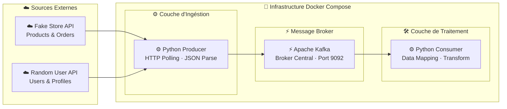

## Pipeline de Données en Temps Réel — Architecture Production-Ready

Ce projet implémente un pipeline de données End-to-End dédié à l’ingestion, au streaming et au stockage de flux de données massifs en temps réel.  
L’architecture est conçue selon les principes fondamentaux du Big Data, en mettant l’accent sur le **haut débit (throughput)**, la **faible latence**, le **découplage des composants** et la **scalabilité horizontale**.

L’objectif est de garantir une circulation fiable, continue et performante des données depuis des sources hétérogènes jusqu’à leur persistance dans un système de stockage structuré et exploitable à des fins analytiques.

---

## Fonctionnalités

- Ingestion asynchrone de données depuis des APIs REST (Fake Store API, Random User API)  
- Transformation des données en événements JSON normalisés  
- Streaming distribué assurant la durabilité et la tolérance aux pannes  
- Traitement des données en temps réel via un processus ETL  
- Gestion des valeurs manquantes (NULL handling) en flux continu  
- Architecture découplée favorisant la résilience et la flexibilité  
- Déploiement conteneurisé garantissant portabilité et reproductibilité  

---

## Architecture

###  Ingestion des Données (Producer)
Un producteur développé en Python interroge de manière asynchrone plusieurs APIs REST.  
Les données collectées sont transformées en événements JSON homogènes afin d’assurer une standardisation en amont du pipeline.

###  Orchestration et Streaming
Le système repose sur Apache Kafka, utilisé comme broker de messages distribué.  
Ce composant assure :
- le découplage entre producteurs et consommateurs  
- un traitement à haut débit (throughput élevé)  
- une persistance fiable des messages  
- une scalabilité horizontale adaptée aux volumes importants  

###  Traitement des Données (Consumer / ETL)
Un consommateur Python implémente un traitement ETL en temps réel :
- consommation des messages depuis les topics Kafka  
- application de règles de mapping pour uniformiser les schémas  
- nettoyage des données, incluant la gestion des valeurs NULL  
- transformation des données pour un usage analytique  

Ce traitement est optimisé pour réduire la latence tout en maintenant une qualité de données élevée.

###  Stockage
Les données traitées sont persistées dans une base de données relationnelle PostgreSQL.  
Ce choix permet :
- une structuration cohérente des données  
- une optimisation pour les requêtes analytiques  
- une garantie d’intégrité et de fiabilité  

---

##  Infrastructure

L’ensemble du pipeline est conteneurisé et orchestré avec Docker Compose.

L’environnement comprend :
- un cluster Kafka (broker et Zookeeper)  
- une base de données PostgreSQL  
- une isolation des services via des réseaux Docker  

Cette architecture garantit :
- la portabilité de l’environnement  
- la reproductibilité des déploiements  
- l’isolation et la sécurité des composants  

---

##  Stack Technique

- Python (ingestion et traitement des données)  
- Apache Kafka (streaming et messagerie distribuée)  
- PostgreSQL (stockage relationnel)  
- Docker et Docker Compose (conteneurisation et orchestration)  

---

##  Caractéristiques Production-Ready

- Architecture distribuée et découplée  
- Haute capacité de traitement (throughput élevé)  
- Faible latence pour le traitement en temps réel  
- Tolérance aux pannes assurée par le broker de messages  
- Gestion robuste des données manquantes (NULL)  
- Scalabilité horizontale des composants  
- Pipeline extensible et adaptable à de nouvelles sources de données  

---